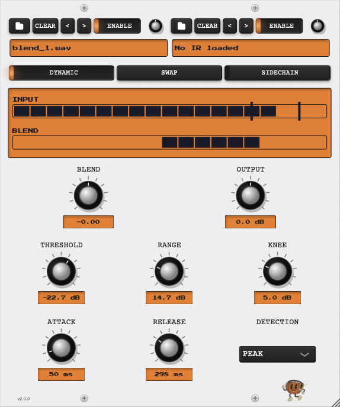
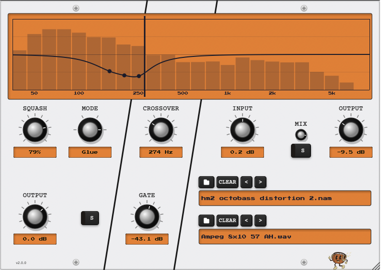

## October Production Co.

Hey there! Welcome to the repo. There are two plugins in here at the moment: OctobIR and OctoBASS. 

- OctobIR is a dual impulse response loader with static and dynamic blending modes. Load up two different guitar cabs and blend between them statically, based on the guitar input volume, or even based on an external sidechain! 
- OctoBASS seeks to be an all-in-one bass plugin, akin to modern metal bass splitting plugins that have compression for the low end and distortion for the high end. Set the crossover frequency, compress the low end to sit well in a mix, and apply a NAM capture to the high band for an infinite amount of distortion options. It's intended to be a free open source alternative to modern bass plugins like Neural DSP's Parallax. 

### OctobIR


### OctoBASS


Hear it in action! Raw bass DI, then the same DI processed by OctoBASS:

**Raw DI**
https://github.com/user-attachments/assets/dc8d3316-7a73-4e9f-92c5-e41b4101d1a1

**Processed**
https://github.com/user-attachments/assets/55826a40-47cb-4395-9ee8-78e17190db8d

## Supported Platforms

| Plugin | VST3 | AU | VCV Rack |
|--------|------|----|----------|
| OctobIR | macOS, Windows, Linux | macOS | macOS, Windows, Linux |
| OctoBASS | macOS, Windows, Linux | macOS | -- |

## Installation

### Option 1: Pre-built Installers (Recommended)

Download the latest release for your platform from [GitHub Releases](https://github.com/gianni-cappelletti/October-Production-Co/releases).

**macOS**
1. Download `OctoberPluginsSuite-<version>-macOS.dmg`
2. Open the DMG and run the installer
3. Apple will try and block it as untrusted, as I am not going to pay them $99 a year for package signing rights on a FOSS project at this stage.
4. Go to System settings and allow the install anyway to complete setup
5. In the installer, choose which plugins and formats to install (OctoBASS VST3/AU, OctobIR VST3/AU)

**Windows**
1. Download `OctoberPluginsSuite-<version>-Windows.exe`
2. Run the installer
3. In the components step, choose which plugins to install (OctoBASS, OctobIR, or both)
4. Follow the installation wizard
5. VST3 plugins will be installed to `C:\Program Files\Common Files\VST3\`

**Linux** (x86_64 and aarch64)
1. Download `OctoberPluginsSuite-<version>-Linux.tar.gz`
2. Extract: `tar -xzf OctoberPluginsSuite-<version>-Linux.tar.gz`
3. Run the installer: `cd OctoberPluginsSuite && ./install.sh` (prompts per-plugin, or pass `--octobir` / `--octobass` to skip prompts)
4. VST3 will be installed to `~/.vst3/`. The bundles ship both x86_64 and aarch64 binaries; your host loads the matching one automatically.

**VCV Rack (OctobIR only)**
- VCV Rack plugins are distributed through the [VCV Library](https://library.vcvrack.com/)
- Search for "OctobIR" in the VCV Rack plugin manager

### Option 2: Building from Source

#### Prerequisites

```bash
# Clone with submodules
git clone --recursive https://github.com/gianni-cappelletti/October-Production-Co.git
cd October-Production-Co

# Or if already cloned
git submodule update --init --recursive

# Initial setup (first time only - installs dependencies)
./scripts/setup-dev.sh
```

#### Build & Install

```bash
make octobir-juce    # Build and install OctobIR JUCE plugins (VST3 + AU)
make octobir-vcv     # Build and install OctobIR VCV Rack plugin
make octobass-juce   # Build and install OctoBASS JUCE plugins (VST3 + AU)
```

**Note**: If you previously installed via the packaged installer, remove the old plugins first:
```bash
# OctobIR
sudo rm -rf ~/Library/Audio/Plug-Ins/VST3/OctobIR.vst3
sudo rm -rf ~/Library/Audio/Plug-Ins/Components/OctobIR.component

# OctoBASS
sudo rm -rf ~/Library/Audio/Plug-Ins/VST3/OctoBASS.vst3
sudo rm -rf ~/Library/Audio/Plug-Ins/Components/OctoBASS.component
```

Installed locations:
- **macOS VST3**: `~/Library/Audio/Plug-Ins/VST3/<Plugin>.vst3`
- **macOS AU**: `~/Library/Audio/Plug-Ins/Components/<Plugin>.component`
- **Linux VST3**: `~/.vst3/<Plugin>.vst3`
- **VCV Rack** (OctobIR only): `~/Documents/Rack2/plugins/OctobIR` (or your Rack plugins directory)


## Reporting Issues

Found a bug, crash, or unexpected behavior? Please open an issue on [GitHub Issues](https://github.com/gianni-cappelletti/October-Production-Co/issues). When reporting, include your OS and version, plugin and host (DAW or VCV Rack) versions, and steps to reproduce. Logs or a short audio/video clip help a lot.

## A note on the use of Claude Code

As a software engineer and a musician, I've spent a lot of time thinking about generative AI and its implications for both sides of my career. I've undergone several existential crises as it relates to my livelihood and the role of my creative work as an artist. In an effort to add some nuanced, principled thoughts to the cultural conversation beyond "AI is an unabated good" and "AI is a scourge on humanity", I've written up an essay here that I hope can provide some sound (no pun intended) thinking on the just and proper use of generative AI as it relates to art and craft.

[Art and Craft: On the use of generative AI](docs/ART_AND_CRAFT.md)

## License

GPL-3.0. Brand assets and the "Art and Craft" essay have separate terms. Per-file license declarations follow the [REUSE specification](https://reuse.software).

Built on JUCE, WDL, pffft, dr_wav, NeuralAmpModelerCore, Eigen, nlohmann/json, and the VCV Rack SDK -- see notices for licenses.

See [`LICENSE`](LICENSE), [`docs/legal/LICENSING.md`](docs/legal/LICENSING.md), [`docs/legal/THIRD_PARTY_NOTICES.txt`](docs/legal/THIRD_PARTY_NOTICES.txt), and [`docs/legal/TRADEMARK.md`](docs/legal/TRADEMARK.md) for full details and third-party attributions.
